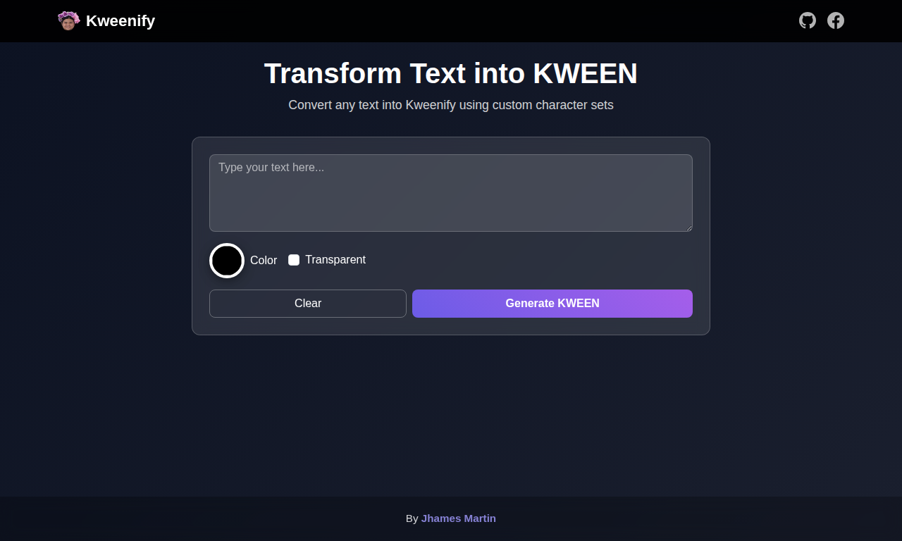
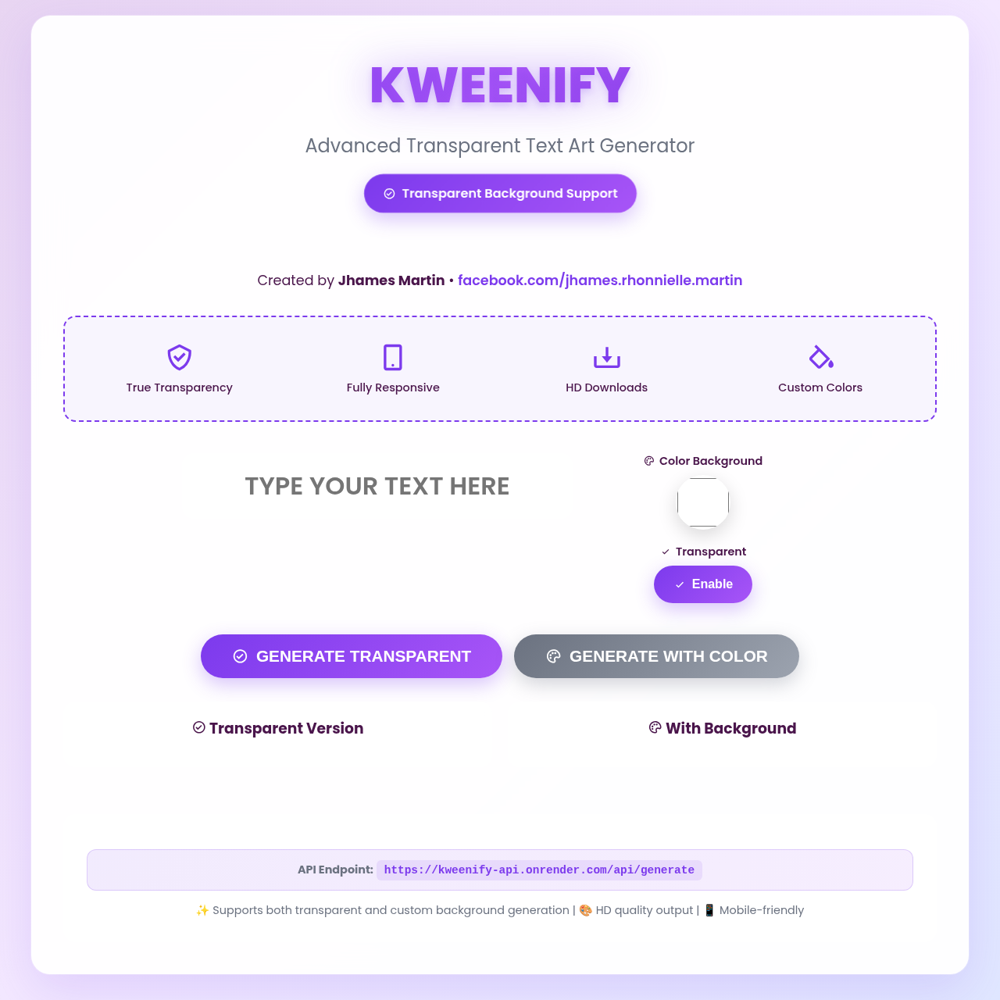

# Kweenify – Kweenyasmin font generator

**Live Demo** → https://kweenify-beryl.vercel.app/  
**Source Code** → https://github.com/jrmph/kweenify-mycode  
**API & Interactive Tester** → https://kweenify-api.onrender.com  
**Creator** → [Jhames Martin](https://www.facebook.com/jhames.rhonnielle.martin)


.png)


### One single HTML file. No dependencies. Pure magic.

A beautiful, glassmorphic, fully responsive web app that instantly converts any text into **high-quality transparent PNG artwork** using the official Kweenify API.

## Features

- True transparent background (real alpha channel)
- Instant preview & download with any solid color background
- HD 1200×630 output – perfect for social media banners, thumbnails, stickers, logos
- One-click download (both versions)
- 100% mobile-friendly with smooth animations
- Glassmorphism UI with shimmer effects, floating buttons, gradients
- Side-by-side live preview grid
- Beautiful toast notifications
- Fully accessible (ARIA, focus styles, reduced-motion support)
- Works with just **one HTML file** – no build required

## How to Use

1. Visit https://kweenify-beryl.vercel.app/
2. Type your text (max 80 characters → auto uppercase)
3. Toggle **Transparent** on/off
4. (Optional) Pick any background color
5. Click **GENERATE TRANSPARENT** or **GENERATE WITH COLOR**
6. Download instantly!

**Pro tip:** Press **Enter** to generate even faster!

## Public API (Free & Open Forever)

**Endpoint**: `POST https://kweenify-api.onrender.com/api/generate`

### Request Body
```json
{
  "text": "YOUR TEXT HERE",
  "background": "transparent"   // or "#ff6b6b", "white", "black", etc.
}
```

### Example with cURL
```bash
curl -X POST https://kweenify-api.onrender.com/api/generate \
  -H "Content-Type: application/json" \
  -d '{"text":"KWEENIFY", "background":"transparent"}'
```

### Response
```json
{
  "success": true,
  "image": "data:image/png;base64,iVBORw0KGgoAAAANSUhEUgAA...",
  "text": "KWEENIFY",
  "generated_at": "2025-12-01T12:00:00.000Z"
}
```

Try the interactive API tester directly: https://kweenify-api.onrender.com

## Tech Stack

- Pure HTML + CSS (modern `clamp()`, Grid, Flexbox)
- Vanilla JavaScript (Fetch + async/await)
- Boxicons & Google Fonts (Poppins)
- Canvas API for real-time color compositing
- Zero frameworks • Zero npm • Zero build tools

## Self-Hosting

Just download `index.html` from the repo and open it in any browser.  
Works 100% offline except for the API call.

## Credits

**Created & Designed by**  
**Jhames Martin**  
18 years old • 1st Year College Student  
Makati Science Technological Institute, Philippines

**Skills**: Node.js, Python, PHP, HTML, CSS, JavaScript, Tailwind, Bootstrap, Supabase, Firebase, Vue, SQL, TypeScript

**Socials**  
Facebook: [facebook.com/jhames.rhonnielle.martin](https://www.facebook.com/jhames.rhonnielle.martin)

Backend/API proudly hosted on Render

## License

You are free to:
- Fork, modify, and use for personal or commercial projects
- Create your own versions or integrations

Just please keep the **“Created by Jhames Martin”** credit visible (the footer is perfect).

---

### Made by Jrmph, masarap mag code pag may kape
— Jhames Martin
